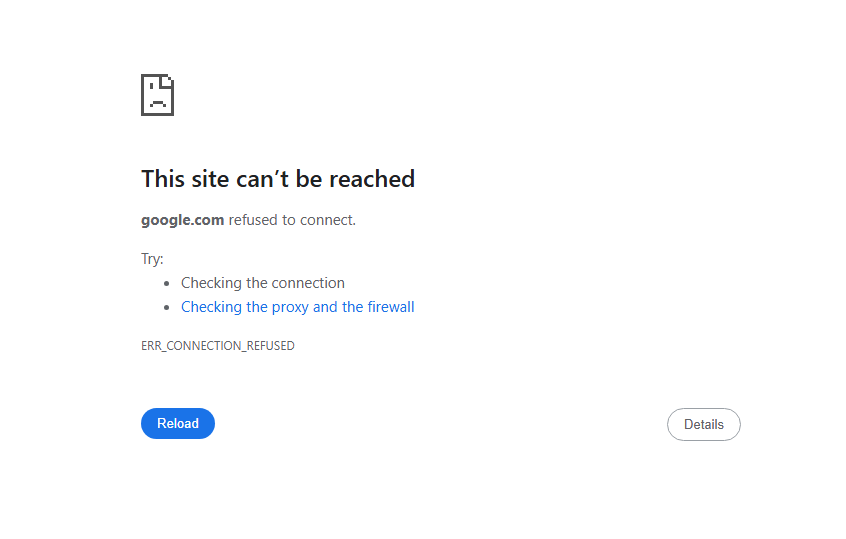

# Website-Blocker-Manager

**Website-Blocker-Manager** is a simple graphical program built with **CustomTkinter** in Python 3.11. The purpose of this program is to help users manage their **hosts** file in Windows for blocking unwanted websites.

## Features
- **Block websites**: Easily block websites by adding them to the **hosts** file.
- **Unblock websites**: Unblock previously blocked websites by removing them from the **hosts** file.
- **Backup**: Create backups of the **hosts** file in your Documents folder before making any changes.
- **User-friendly interface**: The program provides an intuitive GUI for users to interact with the **hosts** file easily.

## Requirements
- **Python 3.11** or higher.
- **Windows** OS (This program works only on Windows).

## How It Works
This program allows you to manage the **hosts** file, which is used by the operating system to map hostnames to IP addresses. By adding entries to the **hosts** file, you can block access to specific websites by redirecting them to a local address (e.g., `127.0.0.1`).

### Blocking Websites
You can add websites to the block list by entering the website's address into the program's input field. After clicking "Add", the website will be added to the **hosts** file, effectively blocking access to it.

#### Screenshot of the Program Interface:
  
_This screenshot shows the user-friendly interface of the program built with CustomTkinter._

### Backup Creation
Before making any changes to the **hosts** file, you can create a backup of the current **hosts** file. This backup will be saved in your **Documents** folder, ensuring that you can easily restore the original file if needed.

### Read-Only Mode
When the program is in read-only mode, it allows you to view the contents of the **hosts** file without making any modifications. This can be useful for checking the current state of blocked websites.

#### Screenshot of Read-Only Mode:
  
_This screenshot demonstrates the program in read-only mode, where no changes are allowed to the **hosts** file._

### Blocked Websites List
Once websites are blocked, they will appear in the list of blocked sites. You can easily see which websites are currently being redirected.

#### Example Blocked Websites List:
  
_This screenshot shows a sample list of blocked websites that have been successfully added to the **hosts** file._

### Failed Attempts to Open Blocked Websites
After blocking websites, any attempt to access them will show an error or failure message. Below are some examples of failed attempts to access blocked websites.

#### Example:
  
_This image shows an example of a failed attempt to open a blocked website._

## Usage
1. Open the **Website-Blocker-Manager** program.
2. To block a website, enter the website's URL and click the "Add" button.
3. **Note**: It's better to add two entries for each website: one without the `www` prefix (e.g., `example.com`) and one with the `www` prefix (e.g., `www.example.com`).
4. To unblock a website, enter the website's URL and click the "Remove" button.
5. To create a backup of the **hosts** file, click the "Create Backup" button.

## Notes
- **Create Backup**: This option creates a backup of the **hosts** file in your **Documents** folder, which can be useful if you want to restore your previous settings.
- The program works **only on Windows** and requires administrative privileges to modify the **hosts** file.

## License
This project is licensed under the MIT License
